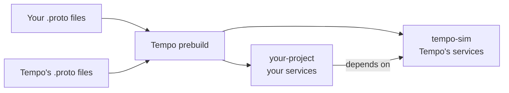

# Client APIs

Tempo's interface is [gRPC](https://grpc.io), defined by `.proto` files. That has two
consequences worth internalizing:

1. **Any language with a gRPC implementation can drive Tempo.** Tempo ships generated,
   ergonomic clients for Python, Rust and C++; anything else can generate its own from the protos.
2. **Clients need not be on the same machine as the sim.** Rust on Linux talking to a sim on a
   Mac is a supported, ordinary setup.

!!! info "ROS is not required"

    gRPC is the primary API. ROS 2 support exists via [TempoROS](../plugins/tempo-ros.md) and
    [TempoROSBridge](../plugins/tempo-ros-bridge.md), and is entirely optional.

## The three clients

<div class="grid cards" markdown>

-   :material-language-python:{ .lg .middle } **[Python](python.md)**

    ---

    Always generated. Installed into `TempoEnv` by the build. Published to PyPI as `tempo-sim`.

-   :material-language-rust:{ .lg .middle } **[Rust](rust.md)**

    ---

    Opt in with `TEMPO_GEN_RUST_API=1`. Published to crates.io as `tempo-sim`.

-   :material-language-cpp:{ .lg .middle } **[C++](cpp.md)**

    ---

    Opt in with `TEMPO_GEN_CPP_API=1`. A static archive plus headers you link against.

</div>

## What "generated client" means

Tempo generates two layers for each language:

- **Protobuf/gRPC stubs** — the message types and service stubs `protoc` produces.
- **A wrapper library** — one function per RPC, with the request's fields flattened into the
  argument list, so you write `spawn_actor(actor_type="BP_SensorRig")` rather than building a
  request message and calling a stub method.

Both a **synchronous** and an **asynchronous** form is generated, with the same signature.

=== "Python"

    ```python
    import tempo_sim.tempo_world as tw

    tw.spawn_actor(actor_type="BP_SensorRig")          # sync
    await tw.spawn_actor(actor_type="BP_SensorRig")    # async — same name
    ```

    The right one is deduced automatically from whether you called it from a synchronous or
    asynchronous context.

=== "Rust"

    ```rust
    use tempo_sim::tempo_world;

    tempo_world::spawn_actor(/* … */)?;                // sync
    tempo_world::spawn_actor_async(/* … */).await?;    // async — `_async` suffix
    ```

=== "C++"

    ```cpp
    #include <tempo.h>

    auto result = tempo::tempo_world::spawn_actor("BP_SensorRig");
    ```

The service name does not appear in the function name — nor does the file name or the proto
package. See [RPC names](../concepts/naming.md#rpc-names) for the exact rule, and the one
restriction it implies.

## Two packages: `tempo-sim` and yours

Tempo's own services generate the publishable **`tempo-sim`** package/crate. If your project
defines its own services, those generate a **separate project package** (e.g. `tempo-sample`)
which depends on `tempo-sim` and re-exports its runtime helpers.



That split is what lets you **publish** your client for your own users — and lets a pure client
project skip the Unreal build entirely by installing the pre-built `tempo-sim` from
[PyPI](https://pypi.org/project/tempo-sim/) or
[crates.io](https://crates.io/crates/tempo-sim).

!!! warning "The published `tempo-sim` knows only Tempo's built-in services"

    If your project defines its own RPCs, use your generated project package rather than the stock
    `tempo-sim` — the stock package has no knowledge of them. Also keep the installed `tempo-sim`
    version matched to the Tempo version your server runs.

## Where to go next

- **[Connecting to a server](connecting.md)** — addresses, ports, and running several sims at once.
- **[Example clients](examples.md)** — the playgrounds shipped with Tempo, including a rerun
  visualizer.
- **[gRPC API reference](../reference/api/index.md)** — every RPC, message and field.
- **[Adding your own services](../guides/custom-services.md)** — how the project package comes to
  exist.
