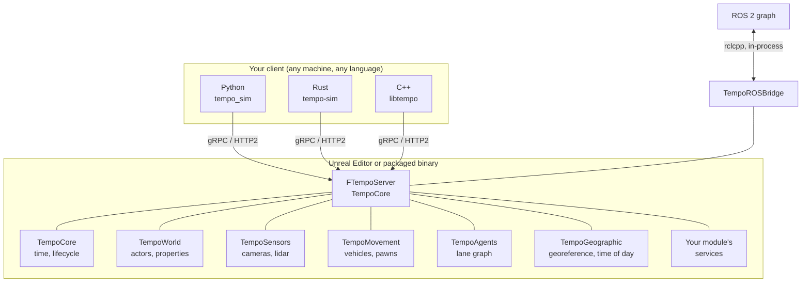

# Architecture

## Plugins and modules

Tempo is a collection of Unreal **plugins**, each containing one or more Unreal **modules**. You
enable the plugins you need in your `.uproject` and ignore the rest.

There is exactly **one** gRPC server per Unreal process (`FTempoServer`, hosted by TempoCore).
Every plugin — and every module in your own project — registers its services with that one
server, so a client opens a single connection and reaches all of them.

## The plugins

| Plugin | What it adds | Depends on |
|---|---|---|
| [TempoCore](../plugins/tempo-core.md) | Time control, the gRPC server, the default HUD, core utilities | — |
| [TempoWorld](../plugins/tempo-world.md) | Query and control actors, components, properties and functions | TempoCore |
| [TempoSensors](../plugins/tempo-sensors.md) | Cameras and lidar, semantic/instance labeling | TempoCore |
| [TempoMovement](../plugins/tempo-movement.md) | Vehicle and pawn movement models and controllers | TempoCore |
| [TempoAgents](../plugins/tempo-agents.md) | Large-scale crowd and traffic agents, lane graph queries | TempoCore |
| [TempoGeographic](../plugins/tempo-geographic.md) | Geographic reference, date/time, sun and sky | TempoCore |
| [TempoPCG](../plugins/tempo-pcg.md) | Custom PCG nodes and graphs for procedural content | — |
| [TempoROS](../plugins/tempo-ros.md) | ROS 2 via in-process `rclcpp`. Standalone — usable without the rest of Tempo | — |
| [TempoROSBridge](../plugins/tempo-ros-bridge.md) | Publishes Tempo's data onto ROS topics | TempoROS, TempoCore |

## How a request reaches your code

1. A client calls a generated wrapper — `tempo_world.spawn_actor(...)` — which builds a protobuf
   request and sends it over gRPC.
2. `FTempoServer` receives the event on its own thread and queues it.
3. On the game thread, TempoCore drains the queue and dispatches each request to the handler that
   registered for that RPC. How much time it spends draining per tick is governed by
   `MaxEventProcessingTimeMicroSeconds` — except in Fixed Step mode, where *all* received events
   are processed every tick, which is what makes stepping deterministic.
4. Your handler runs on the game thread and invokes a response continuation, which may complete
   immediately or later (a deferred level load, a sensor waiting on GPU readback).

Because handlers run on the game thread, an RPC observes a consistent world state — and a slow
handler stalls the frame. Sensor readback is the notable exception; see
[TempoSensors](../plugins/tempo-sensors.md).

## Code generation

Tempo's build is code-generation-first. A prebuild step scans every module in the project for
`.proto` files and generates:

- C++ message and service stubs, for the server side
- Python message modules and a hand-shaped **wrapper library** with one function per RPC
- Optionally, the same for [Rust](../clients/rust.md) and [C++](../clients/cpp.md) clients

Tempo's own services land in the publishable `tempo_sim` package/crate; your project's services
land in a separate package named after your project, which depends on it.

This is why the API reference on this site is generated from the `.proto` files too — the protos
are the single source of truth for everything downstream.

[:octicons-arrow-right-24: Adding your own services](../guides/custom-services.md)

## Engine mods

Tempo makes a handful of small, in-place modifications to your Unreal installation rather than
shipping a custom engine build. `Setup.sh` applies them, and git hooks keep them in sync as you
move between Tempo commits.

[:octicons-arrow-right-24: Engine mods](../guides/engine-mods.md)
