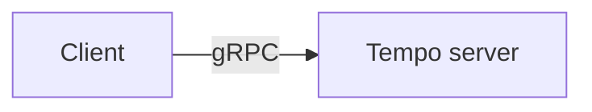

# Contributing to These Docs

This site is built with [MkDocs](https://www.mkdocs.org/) and
[Material for MkDocs](https://squidfunk.github.io/mkdocs-material/), and published by
[Read the Docs](https://readthedocs.org/) from the
[Tempo repository](https://github.com/tempo-sim/Tempo). Every page has an :material-pencil: edit
button that takes you straight to its source.

## Building locally

```bash
cd Plugins/Tempo
python -m venv .venv && source .venv/bin/activate
pip install -r docs/requirements.txt
mkdocs serve
```

`mkdocs serve` live-reloads at <http://localhost:8000>. Before opening a PR, check the build the
way CI does:

```bash
mkdocs build --strict
```

`--strict` turns warnings into errors, and `mkdocs.yml` enables link validation — so a moved page,
a broken relative link, or a stale heading anchor fails the build rather than shipping a dead
link.

## Layout

```text
Plugins/Tempo/
├── mkdocs.yml                  # site config and nav
├── .readthedocs.yaml           # Read the Docs build config
└── docs/
    ├── requirements.txt        # pinned build dependencies
    ├── hooks.py                # build hooks
    ├── gen_api_reference.py    # generates the gRPC reference from the .proto files
    ├── index.md
    ├── getting-started/        # the first hour
    ├── concepts/               # the mental model: time, units, naming, architecture
    ├── plugins/                # one page per plugin
    ├── clients/                # Python / Rust / C++ clients, and the examples
    ├── guides/                 # task-shaped: extend, package, test, CI, troubleshoot
    ├── reference/              # settings, scripts, env vars, and the generated API
    └── migration/              # version-to-version guides
```

## The gRPC reference is generated — don't edit it

Everything under **Reference → gRPC API** is produced at build time by
`docs/gen_api_reference.py`, which stages Tempo's canonical `.proto` files exactly as the build's
prebuild does, compiles them with `protoc`, and renders Markdown from the descriptors.

That means:

- **Document an RPC by commenting the `.proto` file.** Leading comments on services, RPCs,
  messages, fields, enums and enum values all flow into the reference.
- Client-facing names come from `gen_naming.pascal_to_snake`, the same helper the Python, Rust and
  C++ generators use — so a naming rule change updates the docs automatically.
- Nothing under `docs/reference/api/` exists on disk. Don't try to edit it.

!!! tip "Proto comments serve every client language"

    A `.proto` comment is read by Python, Rust and C++ users alike. Describe the wire layout and
    the semantics, not one language's decoding idiom.

## Conventions

- **One idea per page**, linked rather than repeated. Units, naming and time live in
  `concepts/` and are linked from everywhere else, so there is one place to fix them.
- **Prefer `!!!` admonitions** over bolded warnings. `note`, `tip`, `warning`, `danger`, `info`,
  `example` are all available. GitHub's `> [!NOTE]` syntax does **not** render here.
- **Use content tabs** (`=== "Python"`) for the same operation in several languages, rather than
  three stacked code blocks.
- **Relative links between pages, including the `.md` extension** — `../concepts/time.md`. That is
  what lets `--strict` catch a broken one.
- **Give a heading an explicit anchor** when you link to it and its generated slug is awkward:
  `## The exception { #the-exception }`.

## Images

Images are referenced by URL rather than committed, to keep the repository light — Tempo is a
plugin repo that people vendor as a submodule, and binary assets in its history are paid for by
every user forever.

The simplest way to host one: drag it into a GitHub issue or PR comment, and use the
`user-attachments` URL GitHub generates.

```markdown
{ loading=lazy }
/// caption
An optional caption.
///
```

Always write real alt text — it is what a screen reader and a failed image load both fall back to.

### Screenshots we'd love help with

Tempo itself ships very little 3D content; the environments, vehicles and characters in these
screenshots come from [TempoSample](https://github.com/tempo-sim/TempoSample). If you have a
TempoSample project open, these are the gaps:

| Page | Shot |
|---|---|
| [Hello World](../getting-started/hello-world.md) | `BP_SensorRig` freshly spawned in the Lower Sector level, next to the Python REPL that spawned it |
| [TempoSensors](../plugins/tempo-sensors.md) | The same frame as color, depth, and semantic label, side by side |
| [TempoSensors](../plugins/tempo-sensors.md) | A wide-FOV fisheye camera's equidistant output, showing the tiled render |
| [TempoSensors](../plugins/tempo-sensors.md) | A lidar point cloud in `LidarPreview.py`, colorized by intensity |
| [TempoWorld](../plugins/tempo-world.md) | `WorldPlaygroundGUI` editing a live camera property |
| [TempoMovement](../plugins/tempo-movement.md) | The street sweeper driving, and a `SplineActor` trajectory in the Editor |
| [TempoGeographic](../plugins/tempo-geographic.md) | The same scene at two times of day, driven by `TempoSunSky` |
| [TempoPCG](../plugins/tempo-pcg.md) | A landscape before and after `BP_PCGGrass` |
| [Example clients](../clients/examples.md) | The RerunPlayground viewer with its generated layout |

## Diagrams

[Mermaid](https://mermaid.js.org/) diagrams render natively:

````markdown

````

Prefer a diagram when it shows a *mechanism* — dependencies, a pipeline, a decision. Don't draw
one for a list.
