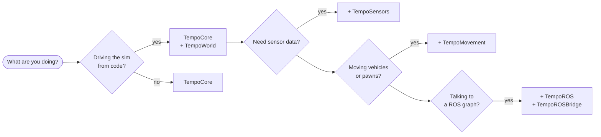

# Plugins

Tempo is a set of Unreal plugins. Enable the ones you need in your `.uproject`; the rest cost you
nothing.

| Plugin | What it gives you |
|---|---|
| **[TempoCore](tempo-core.md)** | Time control, the gRPC server every other plugin registers with, the default HUD, and core utilities. The one plugin everything else depends on. |
| **[TempoWorld](tempo-world.md)** | Query and control the simulated world — spawn and destroy actors, add components, move things, read and write any property, call any function. |
| **[TempoSensors](tempo-sensors.md)** | Cameras (color, depth, semantic and instance labels, 2D bounding boxes, H.264 video) and rotating lidars, streamed over gRPC. |
| **[TempoMovement](tempo-movement.md)** | Vehicle and pawn movement models, a vehicle controller, and timed trajectory following along splines. |
| **[TempoAgents](tempo-agents.md)** | Large-scale crowd and traffic agents on MassEntity, plus lane-graph queries. |
| **[TempoGeographic](tempo-geographic.md)** | Anchor the simulation to a place and time on Earth: geographic reference, date/time, sun and sky. |
| **[TempoPCG](tempo-pcg.md)** | Custom nodes and graphs on top of Epic's PCG plugin, plus sample content. |
| **[TempoROS](tempo-ros.md)** | ROS 2 via in-process `rclcpp`. Standalone — usable without any other Tempo plugin. |
| **[TempoROSBridge](tempo-ros-bridge.md)** | Exposes Tempo's data and controls as ROS 2 topics and services. |

## Which do I need?

Everything except TempoPCG and TempoROS depends on TempoCore, because TempoCore hosts the gRPC
server.

## The plugins are the extension point

Tempo is built entirely as Unreal plugins plus a few small engine patches — there is no closed
core. Your own modules can define gRPC services alongside Tempo's and get generated Python, Rust
and C++ clients for free.

[:octicons-arrow-right-24: Adding your own services](../guides/custom-services.md)
